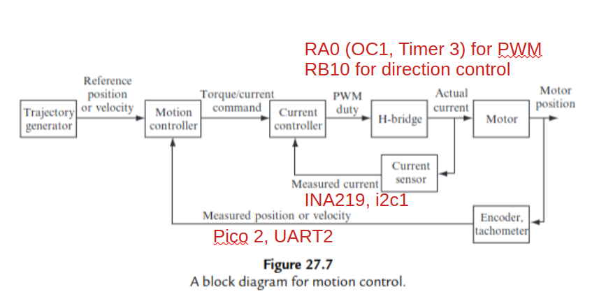
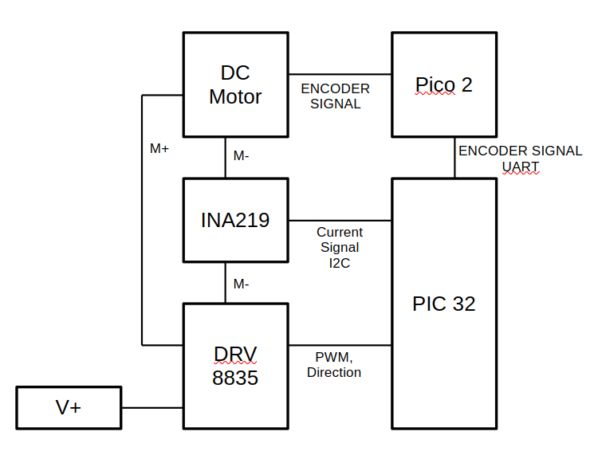
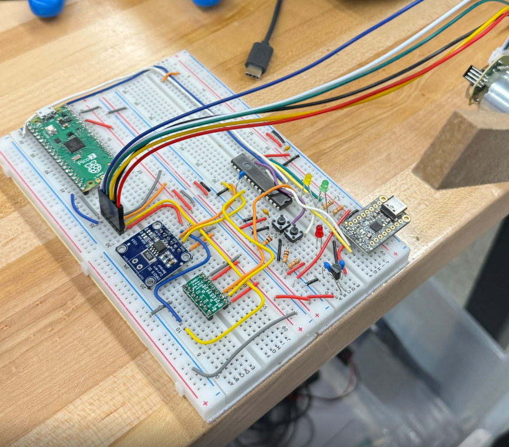

# Homework 10 ME333 - Winter 2025
Zhengyang Kris Weng Submission 03/05/2025

## Chapter 28
Please see `main.c` for more details on all questions

### 28.4.1.1 The ~~NU32~~pico2 communicates with the encoder counter by an SPI channel. Which SPI channel will you use? Which ~~NU32~~ pico 2 pins does it use?
I'm using GP14 and GP15 on pico 2 to read the phases from the encoder. PIC then talks to the Pico 2 through UART 2.

### 28.4.1.2 The ~~NU32~~PIC32 reads the ~~MAX9918~~INA219 current sensor using an ~~ADC input~~I2C. Which ~~ADC input~~I2C will you use? Which ~~NU32~~PIC32 pin is it?
I'm using SDA1 and SCL1 on PIC to talk to INA219. These are pin17 (SCL1) and pin18 (SDA1).

### 28.4.1.3 The ~~NU32~~PIC32 controls the DRV8835 H-bridge using a direction bit (a digital output) and PWM (an output compare and a timer). Which peripherals will you use, and which ~~NU32~~PIC32 pins?

I'm using RB10 for digital output for directional control, and OC1 with Timer 3 for PWM

### 28.4.1.4 Which timers will you use to implement the 200 Hz position control ISR and the 5 kHz current control ISR? What priorities will you use?

I will be using timer 4 and timer 5 for the position control ISR and current control ISR respectively. Since current control loop is more time-critical, I'm planning on using priority 6 for current control, and priority 5 for position control.

### 28.4.1.5 Based on your answers to these questions, and your understanding of the project, annotate the block diagram of Figure 27.7. Each block should clearly indicate which devices or peripherals perform the operation in the block, and each signal line should clearly indicate how the signal is carried from one block to the other. (After this step, there should be no question about the hardware involved in the project. The details of wiring the H-bridge, current sensor, and encoder are left to later.)

### 28.4.1.6 Based on which circuit boards need to be connected to which pins of the ~~NU~~PIC32, and the connections of the circuit boards to the motor and encoder, sketch a proposed layout of the circuit boards relative to the ~~NU~~PIC32 so that wire crossing is approximately minimized. (Do not make a full circuit diagram at this time.)

### 28.4.9.8 Now that the PWM output appears to be working, it is time to wire up the DRV8835 H-bridge circuit, as discussed in Chapter 27.1.1, to the motor and the PIC32 outputs (Figure 28.8). Notice that the 15 m! resistor on the current-sense PCB is in series with the motor. Turn in a circuit diagram showing all connections of the H-bridge to the NU32, motor, and current sensor PCB. Vin O2A O1A GND Vcc GND ENA PHA MD OCx Rxx M

Please see my fully connected breadboard for a reference c:    
