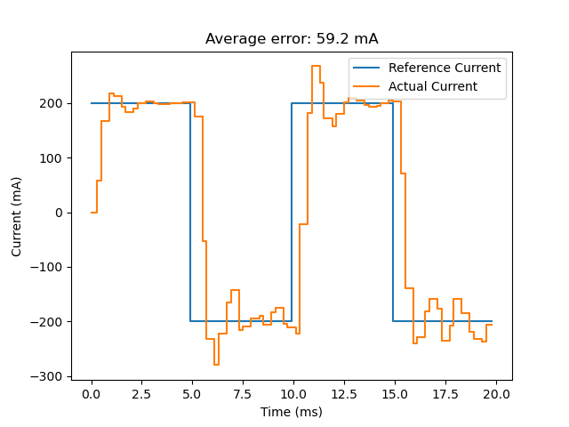
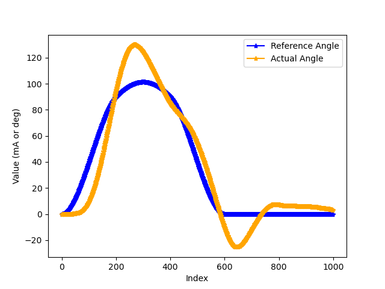
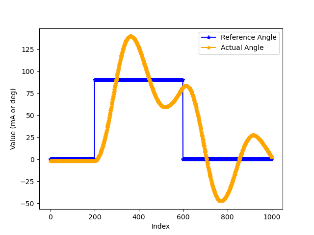

# Homework 11 ME333 - Winter 2025
Zhengyang Kris Weng Submission 03/15/2025

## Chapter 28
### 28.4.10 #5 Turn in your best ITEST plot, and indicate the control gains you used, as well as their units.

- Best Kp: 0.1
- Best Ki: 0.04

Plot:    

### 28.4.12 #5 Turn in your best plots of following the step and cubic trajectories in Figure 28.5 with the load attached. Indicate the control gains you used, as well as their units

- Best Kp_p: 7.5
- Best Ki_p: 0.05
- Best Kd_p: 75.0

Plot - Cubic:    

Plot - Step:     
