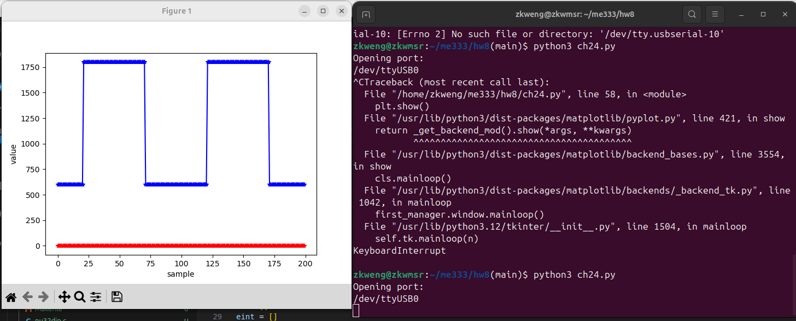
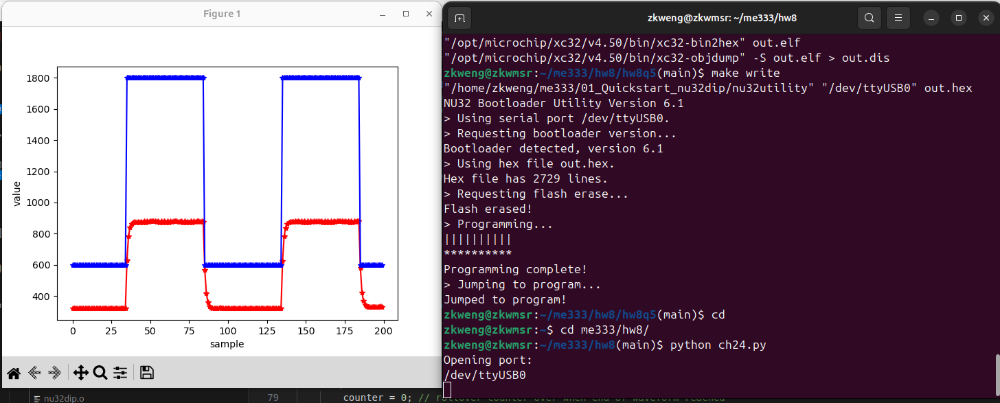
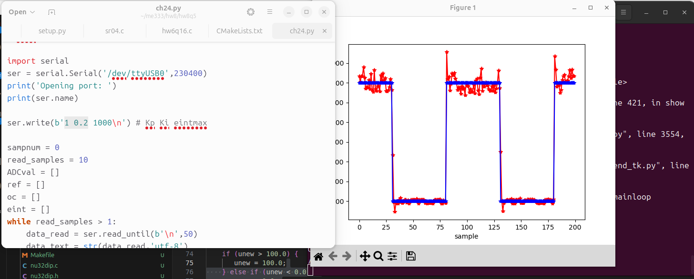

# Homework 7 ME333 - Winter 2025
Zhengyang Kris Weng Submission 02/23/2025

## Chapter 24.
### 24.5
See response plot below:  

### 24.7
See response plot below:  

### 24.8
Kp of 1 and Ki of 0.2 gives a relatively good tracking performance.

See response plot below:  
