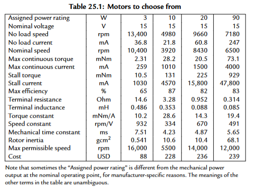

# Homework 9 ME333 - Winter 2025
Zhengyang Kris Weng Submission 03/03/2025

## Chapter 25.

### 25.7 You are choosing a motor for the last joint of a new direct-drive robot arm design. (A direct-drive robot does not use gearheads on the motors, creating high speeds with low friction.) Since it is the last joint of the robot, and it has to be carried by all the other joints, you want it to be as light as possible. From the line of motors you are considering from your favorite motor manufacturer, you know that the mass increases with the motor’s power rating. Therefore you are looking for the lowest power motor that works for your specifications. Your specifications are that the motor should have a stall torque of at least 0.1 Nm, should be able to rotate at least 5 revolutions per second when providing 0.01 Nm, and the motor should be able to operate continuously while providing 0.02 Nm.

From the requirements:
- Stall torque @ 100mNm;
- Continuous torque @ 20mNm;
- 5 RPS = 300 RPM @ 10mNm

3W option:
- stalls at  10.5mNm, **does not** meet the stall torque requirement。

10W option:
- Meets stall torque requirement with 131mNm > 100mNm;
- Meets cont. torque requirement with 28.2mNm > 20mNm;
- Assuming a linear speed-torque relationship, at 10mNm, we find:

    T = T_stall(1 - w/w_no-load) = 28.2 * (1 - 300/4980) = 26.5 mNm

This satisfies the last requirement. Since this is smaller than the other motor options, **10W motor** would be the best choice in the list.

## Chapter 26.

### 26.4.a You are working for a startup robotics company designing a small differential-drive mobile robot, and your job is to choose the motors and gearing. A diff-drive robot has two wheels, each driven directly by its own motor, as well as a caster wheel or two for balance. Your design specifications say that the robot should be capable of continuously climbing a 20◦ slope at 20 cm/s. To simplify the problem, assume that the mass of the whole robot, including motor amplifiers, motors, and gearing, will be 2 kg, regardless of the motors and gearing you choose. Further assume that the robot must overcome a viscous damping force of (10 Ns/m)×v when it moves forward at a constant velocity v, regardless of the slope. The radius of the wheels has already been chosen to be 4 cm, and you can assume they never slip. If you need to make other assumptions to complete the problem, clearly state them. You will choose among the 15 V motors in Table 25.1, as well as gearheads with G = 1, 10, 20, 50, or 100. Assume the gearing efficiency η for G = 1 is 100%, and for the others, 75%. (Do not combine gearheads! You get to use only one.)

Provide a list of all combinations of motor and gearhead that satisfy the specifications, and explain your reasoning. (There are 20 possible combinations: four motors and five gearheads.) “Satisfy the specifications” means that the motor and gearhead can provide at least what is required by the specifications. Remember that each motor only needs to provide half of the total force needed, since there are two wheels.

Assuming g = 9.81;

From the requirements:
- To overcome gravitational force @ 20 degree slope for a 2kg robot with no slip, tangential force needed at the wheel base:

    2kg * 9.81 N/kg * sind(20) = 6.71N

- Considering viscous damping @ 20cm/s

    10 Ns/m * 20 cm/s = 10 Ns/M * 0.2 m/s = 2 N

- Combine:

    F_total = 6.71 + 2 = 8.71N    
    F_half = 8.71 / 2 = 4.36N

- Convert to torque with wheel radius = 4cm:

    T_total = 4.36N * 4cm = 4.36N * 40mm =  174.4mNm

- Wheel speed with radius = 4cm and tangential speed of 20cm/s:
 
    w = 20cm/s / 4cm = 5 rad/s = 48rpm

Convert this to motor spec, we need to overcome 174.4mNm torque @ 48rpm.

For G = 1:    

    T_motor = 174.4mNm, w_motor = 48 rpm:

- 3W and 10W option have stall torque smaller than 174.4mNm;
- for 20W and 90W motors, although they could output 174.4mNm @ 48rpm, this is beyond their max continuous torque and may risk overheat so they still fail.

For G = 10 (with 75 % efficiency)    

    T_motor = 174.4/(10*0.75) = 23.2mNm, w_motor = 480rpm:

- 3W fails
- 10W has max cont. torque 28.2 mNm, and calculated w_motor at this torque is way more than 480rpm. This one passes the requirements.
- 20W has max cont. torque of 20.5mNm, so it fails.
- 90W motor passes.

For G = 20 (with 75 % efficiency)

    T_motor = 174.4/(20*0.75) = 11.6mNm, w_motor = 48*20 = 960rpm:

- 3W still fails.
- 10W passes torque and RPM req.
- 20W passes torque and RPM req.
- 90W passes torque and RPM req.

For G = 50 (with 75 % efficiency)

    T_motor = 174.4/(50*0.75) = 4.7mNm, w_motor = 48*50 = 2400rpm:

- 3W still fails
- 10W passes torque and RPM req.
- 20W passes torque and RPM req.
- 90W passes torque and RPM req.

For G = 100 (with 75 % efficiency)

    T_motor = 174.4/(100 * 0.75) = 2.3mNm, w_motor = 48*100 = 4800rpm:

- 3W marginally passes torque requirement. Assuming linear speed-torque relationship, it has a nominal speed of 10464rpm at this load. So this would pass the requirements.
- 10W passes torque requirement. Assuming linear speed-torque relationship, it has a nominal speed of 4892rpm at this load, marginally passing RPM requirement.
- 20W passes torque and RPM req.
- 90W passes torque and RPM req.

In conclusion:

| Motor  | G=1 (100%) | G=10 (75%)     | G=20 (75%)    | G=50 (75%)  | G=100 (75%) |
|--------|-----------:|:--------------:|:-------------:|:-----------:|:-----------:|
| **3 W**  | Fail  | Fail            | Fail           | Fail        | Pass        |
| **10 W** | Fail  | Pass            | Pass           | Pass        | Pass        |
| **20 W** | Fail  | Fail            | Pass           | Pass        | Pass        |
| **90 W** | Fail  | Pass            | Pass           | Pass        | Pass        |